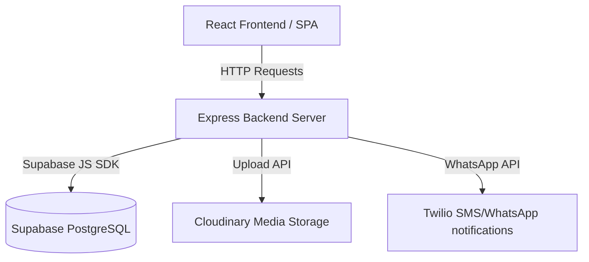

# Vallery - Bespoke Metal Craft & Product Design

A premium, interactive portfolio and product showcase application for bespoke metal craftsmanship, where metal meets mastery.

---

## 🏗️ Project Architecture Overview

The project uses a unified **Monorepo / Full-Stack** layout built on a **React + Express + Supabase** stack.



### 1. Technology Stack
*   **Frontend**: React (SPA), TypeScript, Vite, TailwindCSS (for styling), React Router DOM (routing), Framer Motion (premium animations), and Zustand (lightweight client state management).
*   **Backend**: Express.js server running in Node.js.
*   **Dev Integration**: In development, Express runs Vite as middleware so you only run a single process (`npm run dev`) for both client and server. In production, Express serves the statically built frontend folder (`dist`).
*   **Database**: Supabase (PostgreSQL), utilizing the `@supabase/supabase-js` SDK for CRUD operations.
*   **External Integrations**:
    *   **Cloudinary**: Handles high-performance CDN storage for uploaded files (logos, product images).
    *   **Twilio**: Sends instant alerts (e.g. WhatsApp/SMS notifications) when new client requests are submitted.
    *   **Web3Forms / Nodemailer**: Sends email contact submissions.

---

## 📂 Project Directory Structure

```text
├── server.ts                  # Backend server entry & Vite integration
├── supabase_schema.sql         # SQL script to initialize DB tables
├── package.json               # Dependencies & scripts
├── vite.config.ts             # Vite configuration
├── .env                       # Environment credentials (Git-ignored)
└── src/
    ├── App.tsx                # Main client Router, Layout, & Auth checker
    ├── main.tsx               # Renders React into the HTML DOM
    ├── index.css              # Custom styling definitions
    │
    ├── store/
    │   └── useStore.ts        # Zustand global state store (admin & site settings)
    │
    ├── components/            # Shared UI components
    │   ├── CustomCursor.tsx   # Premium custom floating cursor
    │   ├── Navbar.tsx         # Responsive header
    │   ├── Footer.tsx         # Footers showing site settings metadata
    │   ├── ProductCard.tsx    # Card representation of metal crafts
    │   └── RequestModal.tsx   # Lead generation/quote request popups
    │
    ├── pages/                 # Full Page components
    │   ├── Home.tsx           # Dynamic Landing page with Hero and Featured items
    │   ├── Products.tsx       # Searchable catalog
    │   ├── ProductDetail.tsx  # Detailed specifications & CTAs
    │   ├── About.tsx          # Studio craftsmanship showcase
    │   ├── Contact.tsx        # Client inquiries
    │   └── Admin/
    │       ├── Login.tsx      # Admin authentication page
    │       └── Dashboard.tsx  # Admin CRUD dashboard for products/requests/settings
    │
    └── server/                # Backend API Implementation
        ├── middleware/
        │   ├── auth.ts        # JWT token verifier middleware
        │   └── upload.ts      # Multer memory storage configuration for file uploads
        │
        ├── routes/
        │   ├── auth.ts        # Credentials verification, login, profile routes
        │   ├── products.ts    # Product listings (public) & modifications (admin only)
        │   ├── requests.ts    # Quote request creations & status updates (admin only)
        │   └── settings.ts    # Website settings fetching (public) & updates (admin only)
        │
        └── utils/
            ├── supabase.ts    # Supabase Client connection pool
            ├── seed.ts        # Automatically seeds default admin & settings
            ├── cloudinary.ts  # Upload helper class interfacing with Cloudinary API
            └── notifications.ts # Twilio handler for WhatsApp customer request notifications
```

---

## 🗄️ Database Tables Schema (`supabase_schema.sql`)

The backend interfaces with four tables:

1.  **`admins`**: Stores admin records for access credentials.
    *   `id` (UUID, Primary Key)
    *   `username` (TEXT, Unique)
    *   `password` (TEXT, Bcrypt encrypted hash)
    *   `name` (TEXT)
2.  **`products`**: Craft portfolio details.
    *   `id` (UUID, Primary Key)
    *   `title` (TEXT), `description` (TEXT), `price` (NUMERIC)
    *   `category` (TEXT), `image_url` (TEXT)
    *   `is_published` (BOOLEAN)
3.  **`requests`**: Inbound customer custom order inquiries.
    *   `id` (UUID, Primary Key)
    *   `customer_name` (TEXT), `customer_email` (TEXT), `customer_phone` (TEXT)
    *   `message` (TEXT), `status` (TEXT: `pending`, `contacted`, `completed`, `cancelled`)
    *   `product_id` (UUID, Foreign Key referencing `products.id`)
4.  **`settings`**: Dynamic configurations for the website presentation (allows admins to edit site details on the fly).
    *   `website_title`, `website_description`
    *   `admin_email`, `admin_phone` (used for notifications)
    *   `logo_url`, `instagram_username`, `formspree_key`
    *   `hero_title`, `hero_subtitle`, `hero_button` (Dynamic landing text configuration)
    *   `atelier_address`

---

## 🚀 Key Workflows

### 🛡️ Authentication Flow
1.  Admin logs in via `/admin/login` -> submits credentials.
2.  Backend `auth.ts` verifies username and password, generates a JWT token, and returns it.
3.  Frontend stores token in `localStorage`. 
4.  Subsequent requests to admin routes include the token in the `Authorization: Bearer <token>` header.

### 📥 Lead & Notification Flow
1.  Client views product -> clicks "Request Quote" -> fills out `RequestModal`.
2.  Form submits to `/api/requests`.
3.  Backend inserts the record in Supabase database.
4.  Backend calls `notifications.ts`, executing Twilio's API to send a WhatsApp notification message to the admin's phone number, alerting them about the new lead.

### 🌐 Automatic Seeding
When the backend application initializes (`server.ts`), it automatically checks the `admins` and `settings` tables. If they are empty, it populates them using the environment variables defined in `.env`:
*   **Admin Email**: Set via `DEFAULT_ADMIN_EMAIL` (default: `admin@example.com`)
*   **Admin Password**: Set via `DEFAULT_ADMIN_PASSWORD` (default: `AdminSecure123!`)
*   **Default Settings**: Site title, admin email, and admin phone.
